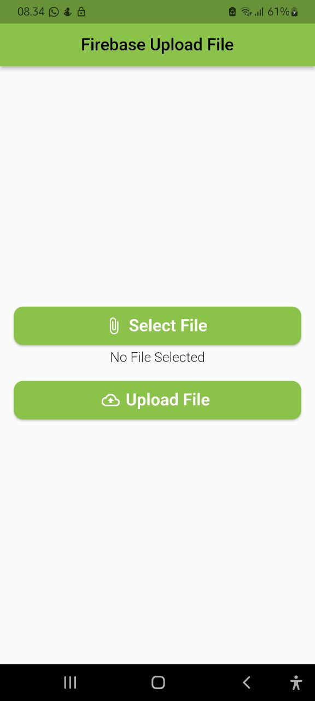
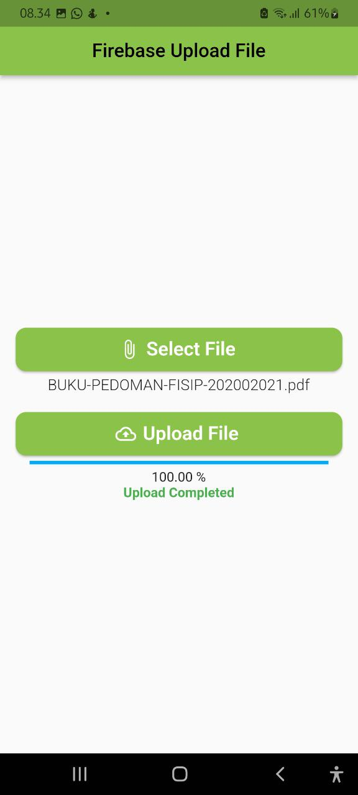

# BOOTCAMP FLUTTER PROJECT : Document Upload App

### Description
Create application that aims to upload documents to firebase

### Features
- Upload Document

### Package
- flutter_launcher_icons
- firebase_core
- cloud_storage
- file_picker

### Tech Used
 

## Screenshots

  |  |

